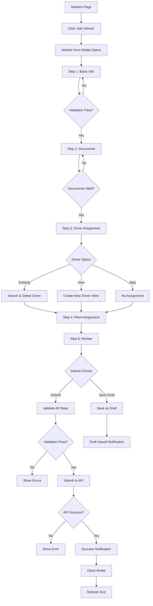
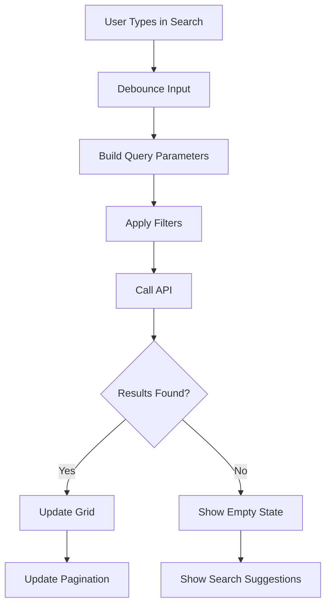
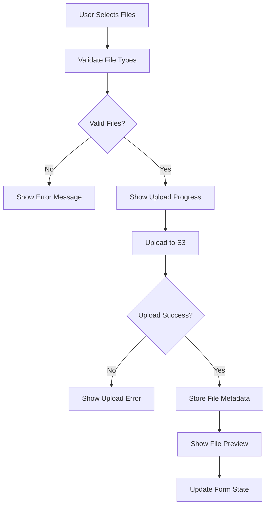

# 🏭 VMS Masters Page - Complete Development Blueprint

## 📋 Table of Contents
1. [Overview](#overview)
2. [Schema Analysis](#schema-analysis)
3. [UI/UX Design](#uiux-design)
4. [Component Architecture](#component-architecture)
5. [Flow Diagrams](#flow-diagrams)
6. [API Integration](#api-integration)
7. [Form Validation](#form-validation)
8. [File Upload Strategy](#file-upload-strategy)
9. [State Management](#state-management)
10. [Testing Strategy](#testing-strategy)
11. [Implementation Phases](#implementation-phases)

---

## 🎯 Overview

### **Purpose**
The Masters page is a comprehensive management interface for Vehicle and Driver master data in the VMS (Vehicle Management System). It provides unified workflows for creating, editing, and managing the relationship between vehicles and drivers.

### **Key Features**
- ✅ Multi-step vehicle creation with document upload
- ✅ Driver creation and management 
- ✅ Vehicle-Driver assignment workflows
- ✅ Document management with S3 integration
- ✅ Real-time validation and error handling
- ✅ Draft system for incomplete forms
- ✅ Advanced search and filtering
- ✅ Bulk operations and CSV import
- ✅ Approval workflow integration

### **Target Users**
- **Plant Administrators**: Create and manage vehicles/drivers for their plant
- **HQ Administrators**: Approve/reject submissions and manage all masters
- **System Administrators**: Bulk operations and system-wide management

---

## 📊 Schema Analysis

### **🚗 Vehicle Master Schema**

#### **Identity & Status Group**
```javascript
{
  custrecord_vehicle_number: String (required, unique),
  custrecord_vehicle_name_ag: String,
  custrecord_vehicle_type_ag: Enum["ODC", "Lattice Tower"] (required),
  approved_by_hq: Enum["approved", "pending", "rejected"] (default: "pending"),
  approvalMeta: {
    reviewer: String,
    reviewedAt: Date,
    reviewMessage: String,
    resubmitCount: Number (default: 0)
  }
}
```

#### **Technical Details Group**
```javascript
{
  custrecord_chassis_number: String,
  custrecord_engine_number_ag: String,
  custrecord_age_of_vehicle: String,
  custrecord_vehicle_master_gps_available: Boolean (default: false)
}
```

#### **Ownership Group**
```javascript
{
  custrecord_owner_name_ag: String,
  custrecord_owner_no_ag: String,
  custrecord_vendor_name_ag: {
    id: String,
    name: String,
    isInactive: Boolean (default: false)
  }
}
```

#### **Legal Documents Group**
```javascript
{
  // RC Document
  custrecord_rc_no: String,
  custrecord_rc_start_date: Date,
  custrecord_rc_end_date: Date,
  custrecord_rc_doc_attach: [AttachmentSchema],

  // Insurance
  custrecord_insurance_company_name_ag: String,
  custrecord_insurance_number_ag: String,
  custrecord_insurance_start_date_ag: Date,
  custrecord_insurance_end_date_ag: Date,
  custrecord_insurance_attachment_ag: [AttachmentSchema],

  // Permit
  custrecord_permit_number_ag: String,
  custrecord_permit_start_date: Date,
  custrecord_permit_end_date: Date,
  custrecord_permit_attachment_ag: [AttachmentSchema],

  // PUC
  custrecord_puc_number: String,
  custrecord_puc_start_date_ag: Date,
  custrecord_puc_end_date_ag: Date,
  custrecord_puc_attachment_ag: [AttachmentSchema],

  // Fitness Certificate
  custrecord_tms_vehicle_fit_cert_attach: [AttachmentSchema],
  custrecord_tms_vehicle_fit_cert_vld_upto: Date
}
```

#### **Operational Group**
```javascript
{
  currentPlant: Enum["pune", "solapur", "surat", "free", "in transit"] (default: "free"),
  assignedDriver: ObjectId (ref: 'drivermaster'),
  checklist: Mixed (dynamic checklist object),
  checklistConfirmed: Boolean (default: false),
  driverConfirmed: Boolean (default: false),
  inTrip: Boolean (default: false)
}
```

### **👤 Driver Master Schema**

#### **Identity & Status Group**
```javascript
{
  custrecord_driver_name: String (required),
  custrecord_driver_mobile_no: String (required),
  custrecord_driver_photo_ag: String,
  approved_by_hq: Enum["approved", "pending", "rejected"] (default: "pending"),
  approvalMeta: {
    reviewer: String,
    reviewedAt: Date,
    reviewMessage: String,
    resubmitCount: Number (default: 0)
  }
}
```

#### **License Details Group**
```javascript
{
  custrecord_driving_license_no: String (required),
  custrecord_driving_license_s_date: String (required),
  custrecord_driver_license_e_date: String (required),
  custrecord_driving_license_attachment: [String] (required),
  custrecord_license_category_ag: Enum[
    "Light Motor Vehicle",
    "Medium Passenger Vehicle", 
    "Medium Goods Vehicle",
    "Heavy Passenger Vehicle",
    "Heavy Goods Vehicle"
  ] (default: "Light Motor Vehicle")
}
```

#### **Optional Fields Group**
```javascript
{
  custrecord_driving_lca_test: String,
  custrecord_create_by_driver_master: String,
  fcm_token: String
}
```

### **📎 Attachment Schema**
```javascript
{
  url: String (required),
  fileName: String,
  mimeType: String,
  uploadedAt: Date (default: Date.now)
}
```

---

## 🎨 UI/UX Design

### **🏗️ Page Layout Structure**

```
Masters Page Layout
├── Header Section (Fixed)
│   ├── Page Title & Breadcrumb
│   ├── Quick Stats Cards (4 cards)
│   └── Primary Action Buttons
│
├── Tab Navigation
│   ├── 🚗 Vehicle Masters
│   ├── 👤 Driver Masters
│   └── 🔗 Assignments View
│
├── Filter & Search Bar
│   ├── Global Search Input
│   ├── Status Filter Dropdown
│   ├── Plant Filter Dropdown
│   └── Advanced Filters Toggle
│
├── Data Grid/Cards Area
│   ├── Responsive Card Grid
│   ├── Loading Skeletons
│   ├── Empty States
│   └── Error States
│
├── Pagination
│   ├── Page Numbers
│   ├── Items per Page
│   └── Total Count Display
│
└── Modal System
    ├── Vehicle Form Modal (5 steps)
    ├── Driver Form Modal
    ├── Assignment Modal
    └── Confirmation Dialogs
```

### **📱 Responsive Design Breakpoints**

```css
/* Mobile First Approach */
.masters-grid {
  /* Mobile: 1 column */
  @apply grid-cols-1 gap-4;
  
  /* Tablet: 2 columns */
  @media (min-width: 768px) {
    @apply grid-cols-2 gap-6;
  }
  
  /* Desktop: 3 columns */
  @media (min-width: 1024px) {
    @apply grid-cols-3;
  }
  
  /* Large Desktop: 4 columns */
  @media (min-width: 1280px) {
    @apply grid-cols-4;
  }
  
  /* Extra Large: 5 columns */
  @media (min-width: 1536px) {
    @apply grid-cols-5;
  }
}
```

### **🎨 Design Tokens**

```javascript
// Color System (inherited from approval page)
const masterTheme = {
  // Status Colors
  pending: {
    bg: 'bg-orange-50',
    text: 'text-orange-700',
    border: 'border-orange-200',
    gradient: 'from-orange-500 to-orange-600'
  },
  approved: {
    bg: 'bg-green-50',
    text: 'text-green-700',
    border: 'border-green-200',
    gradient: 'from-green-500 to-green-600'
  },
  rejected: {
    bg: 'bg-red-50',
    text: 'text-red-700',
    border: 'border-red-200',
    gradient: 'from-red-500 to-red-600'
  },
  
  // Entity Colors
  vehicle: {
    primary: 'text-blue-600',
    bg: 'bg-blue-50',
    border: 'border-blue-200'
  },
  driver: {
    primary: 'text-indigo-600',
    bg: 'bg-indigo-50',
    border: 'border-indigo-200'
  }
};

// Animation Tokens
const animations = {
  // Hover effects
  cardHover: {
    scale: 1.02,
    boxShadow: "0 20px 40px rgba(0,0,0,0.1)",
    y: -2
  },
  
  // Page transitions
  pageTransition: {
    initial: { opacity: 0, y: 20 },
    animate: { opacity: 1, y: 0 },
    exit: { opacity: 0, y: -20 },
    transition: { duration: 0.3 }
  },
  
  // Stagger animations
  staggerContainer: {
    animate: {
      transition: { staggerChildren: 0.05 }
    }
  }
};

// Spacing System
const spacing = {
  cardPadding: 'p-6',        // 24px
  gridGap: 'gap-6',          // 24px
  sectionMargin: 'mb-12',    // 48px
  borderRadius: {
    card: 'rounded-3xl',     // 24px
    button: 'rounded-xl',    // 12px
    modal: 'rounded-3xl'     // 24px
  }
};
```

---

## 🏗️ Component Architecture

### **📁 File Structure**

```
src/components/Masters/
├── index.js                          # Main exports
├── MastersContainer.jsx               # Root container component
├── MastersHeader.jsx                  # Header with stats and actions
├── MastersTabs.jsx                    # Tab navigation component
├── MastersSearch.jsx                  # Search and filter component
├── MastersPagination.jsx              # Pagination component
│
├── Vehicle/
│   ├── index.js                       # Vehicle component exports
│   ├── VehicleGrid.jsx                # Vehicle cards grid container
│   ├── VehicleCard.jsx                # Individual vehicle card
│   ├── VehicleFilters.jsx             # Vehicle-specific filters
│   ├── VehicleForm/
│   │   ├── VehicleFormModal.jsx       # Main form modal wrapper
│   │   ├── FormStepNavigation.jsx     # Step indicator component
│   │   ├── Steps/
│   │   │   ├── BasicInfoStep.jsx      # Step 1: Basic information
│   │   │   ├── DocumentsStep.jsx      # Step 2: Document uploads
│   │   │   ├── DriverAssignStep.jsx   # Step 3: Driver assignment
│   │   │   ├── PlantAssignStep.jsx    # Step 4: Plant assignment
│   │   │   └── ReviewStep.jsx         # Step 5: Review and submit
│   │   ├── FormSections/
│   │   │   ├── VehicleInfo.jsx        # Vehicle details section
│   │   │   ├── OwnerDetails.jsx       # Owner information section
│   │   │   ├── TechnicalDetails.jsx   # Technical specifications
│   │   │   └── DocumentSection.jsx    # Document upload section
│   │   └── Validation/
│   │       ├── vehicleValidation.js   # Vehicle form validation rules
│   │       └── stepValidation.js      # Step-by-step validation
│   └── VehicleActions.jsx             # Vehicle action buttons
│
├── Driver/
│   ├── index.js                       # Driver component exports
│   ├── DriverGrid.jsx                 # Driver cards grid container
│   ├── DriverCard.jsx                 # Individual driver card
│   ├── DriverFilters.jsx              # Driver-specific filters
│   ├── DriverForm/
│   │   ├── DriverFormModal.jsx        # Driver creation modal
│   │   ├── DriverBasicInfo.jsx        # Basic driver information
│   │   ├── LicenseDetails.jsx         # License information form
│   │   ├── DriverDocuments.jsx        # Document upload for driver
│   │   └── driverValidation.js        # Driver form validation
│   ├── DriverSearch.jsx               # Driver search component
│   └── DriverActions.jsx              # Driver action buttons
│
├── Assignment/
│   ├── index.js                       # Assignment component exports
│   ├── AssignmentGrid.jsx             # Assignment view grid
│   ├── AssignmentCard.jsx             # Vehicle-driver assignment card
│   ├── AssignmentModal.jsx            # Assignment/reassignment modal
│   ├── AssignmentFilters.jsx          # Assignment-specific filters
│   └── AssignmentActions.jsx          # Assignment action buttons
│
├── Common/
│   ├── index.js                       # Common component exports
│   ├── DocumentUpload/
│   │   ├── DocumentUpload.jsx         # Main upload component
│   │   ├── FilePreview.jsx            # File preview component
│   │   ├── UploadProgress.jsx         # Upload progress indicator
│   │   └── uploadUtils.js             # Upload utility functions
│   ├── FormComponents/
│   │   ├── FormField.jsx              # Reusable form field
│   │   ├── FormSection.jsx            # Form section wrapper
│   │   ├── FormSteps.jsx              # Multi-step form wrapper
│   │   └── FormValidation.jsx         # Validation message component
│   ├── StatusComponents/
│   │   ├── StatusBadge.jsx            # Status indicator badge
│   │   ├── ApprovalStatus.jsx         # Approval status component
│   │   └── DocumentStatus.jsx         # Document validity indicator
│   ├── SearchComponents/
│   │   ├── SearchBox.jsx              # Global search input
│   │   ├── FilterDropdown.jsx         # Filter dropdown component
│   │   └── AdvancedFilters.jsx        # Advanced filter panel
│   ├── Cards/
│   │   ├── BaseCard.jsx               # Base card component (inherited)
│   │   ├── StatsCard.jsx              # Statistics card component
│   │   └── EmptyStateCard.jsx         # Empty state component
│   ├── Modals/
│   │   ├── BaseModal.jsx              # Base modal (inherited)
│   │   ├── ConfirmationModal.jsx      # Confirmation dialog
│   │   └── LoadingModal.jsx           # Loading state modal
│   └── Utils/
│       ├── dateUtils.js               # Date formatting utilities
│       ├── validationUtils.js         # Validation helper functions
│       ├── formatUtils.js             # Data formatting utilities
│       └── constants.js               # Constants and enums
│
└── Hooks/
    ├── useMasters.js                  # Main masters data hook
    ├── useVehicles.js                 # Vehicle management hook
    ├── useDrivers.js                  # Driver management hook
    ├── useAssignments.js              # Assignment management hook
    ├── useDocumentUpload.js           # Document upload hook
    ├── useFormValidation.js           # Form validation hook
    └── useMasterFilters.js            # Filter and search hook
```

### **🧩 Component Specifications**

#### **MastersContainer.jsx**
```jsx
const MastersContainer = () => {
  // Main container component
  // Responsibilities:
  // - Route management between tabs
  // - Global state management
  // - Error boundary
  // - Loading states
  // - User permissions
};
```

#### **VehicleFormModal.jsx**
```jsx
const VehicleFormModal = ({ 
  isOpen, 
  onClose, 
  vehicleId = null, // null for create, id for edit
  initialStep = 1,
  onSuccess 
}) => {
  // Multi-step form modal
  // State management for 5 steps
  // Progress tracking
  // Draft saving
  // Validation coordination
};
```

#### **VehicleCard.jsx**
```jsx
const VehicleCard = ({ 
  vehicle, 
  onEdit, 
  onAssignDriver, 
  onViewDetails,
  showActions = true,
  compact = false 
}) => {
  // Individual vehicle display card
  // Status indicators
  // Quick actions
  // Document status
  // Driver assignment status
};
```

---

## 🔄 Flow Diagrams

### **🎯 Primary Flow: Complete Vehicle Creation**



### **🔍 Search & Filter Flow**



### **📎 Document Upload Flow**



---

## 🔌 API Integration

### **📡 Vehicle Master APIs**

```javascript
// Vehicle CRUD Operations
const vehicleAPI = {
  // Create new vehicle
  createVehicle: async (formData) => {
    return await fetch('/api/vehicle', {
      method: 'POST',
      body: formData // FormData with files
    });
  },

  // Get vehicle by number
  getVehicle: async (vehicleNumber, includeDriver = false) => {
    return await fetch(`/api/vehicle/number/${vehicleNumber}?includeDriver=${includeDriver}`);
  },

  // Update vehicle
  updateVehicle: async (vehicleNumber, formData) => {
    return await fetch(`/api/vehicle/${vehicleNumber}`, {
      method: 'PATCH',
      body: formData
    });
  },

  // Get vehicles by plant and status
  getVehiclesByPlant: async (plant, status = 'all', page = 1, limit = 20) => {
    return await fetch(`/api/vehicle/plant/${plant}?status=${status}&page=${page}&limit=${limit}`);
  },

  // Vehicle approval (HQ only)
  approveVehicle: async (vehicleId, approvalData) => {
    return await fetch(`/api/vehicle-master/approval/${vehicleId}`, {
      method: 'PATCH',
      headers: { 'Content-Type': 'application/json' },
      body: JSON.stringify(approvalData)
    });
  }
};
```

### **👤 Driver Master APIs**

```javascript
// Driver CRUD Operations
const driverAPI = {
  // Create new driver
  createDriver: async (formData) => {
    return await fetch('/api/driver-master', {
      method: 'POST',
      body: formData // FormData with photo and license
    });
  },

  // Get all drivers
  getDrivers: async (filters = {}) => {
    const params = new URLSearchParams(filters);
    return await fetch(`/api/driver-master?${params}`);
  },

  // Get driver by license
  getDriverByLicense: async (licenseNumber) => {
    return await fetch('/api/driver-master/licence', {
      method: 'POST',
      headers: { 'Content-Type': 'application/json' },
      body: JSON.stringify({ licenseNumber })
    });
  },

  // Update driver
  updateDriver: async (driverId, formData) => {
    return await fetch(`/api/driver-master/${driverId}`, {
      method: 'PATCH',
      body: formData
    });
  },

  // Driver approval (HQ only)
  approveDriver: async (driverId, approvalData) => {
    return await fetch(`/api/driver-master/approval/${driverId}`, {
      method: 'PATCH',
      headers: { 'Content-Type': 'application/json' },
      body: JSON.stringify(approvalData)
    });
  }
};
```

### **🔗 Assignment APIs**

```javascript
// Vehicle-Driver Assignment Operations
const assignmentAPI = {
  // Assign driver to vehicle
  assignDriver: async (vehicleNumber, driverLicenseNo) => {
    return await fetch(`/api/vehicle/${vehicleNumber}/assign-driver`, {
      method: 'POST',
      headers: { 'Content-Type': 'application/json' },
      body: JSON.stringify({ driverLicenseNo })
    });
  },

  // Change vehicle driver
  changeDriver: async (vehicleNumber, newDriverLicenseNo) => {
    return await fetch(`/api/vehicle/${vehicleNumber}/change-driver`, {
      method: 'PUT',
      headers: { 'Content-Type': 'application/json' },
      body: JSON.stringify({ driverLicenseNo: newDriverLicenseNo })
    });
  },

  // Remove driver from vehicle
  removeDriver: async (vehicleNumber) => {
    return await fetch(`/api/vehicle/${vehicleNumber}/remove-driver`, {
      method: 'DELETE'
    });
  }
};
```

---

## ✅ Form Validation

### **🚗 Vehicle Validation Rules**

```javascript
const vehicleValidationSchema = {
  // Step 1: Basic Information
  basicInfo: {
    custrecord_vehicle_number: {
      required: true,
      pattern: /^[A-Z]{2}[0-9]{2}[A-Z]{1,2}[0-9]{4}$/, // Indian vehicle number
      message: 'Please enter valid vehicle number (e.g., MH12AB1234)'
    },
    custrecord_vehicle_type_ag: {
      required: true,
      enum: ['ODC', 'Lattice Tower'],
      message: 'Please select vehicle type'
    },
    custrecord_owner_name_ag: {
      minLength: 2,
      maxLength: 100,
      message: 'Owner name must be 2-100 characters'
    },
    custrecord_owner_no_ag: {
      pattern: /^[+]?[0-9]{10,15}$/,
      message: 'Please enter valid phone number'
    }
  },

  // Step 2: Documents
  documents: {
    custrecord_rc_no: {
      required: true,
      message: 'RC number is required'
    },
    custrecord_rc_start_date: {
      required: true,
      type: 'date',
      message: 'RC start date is required'
    },
    custrecord_rc_end_date: {
      required: true,
      type: 'date',
      validate: (value, formData) => {
        return new Date(value) > new Date(formData.custrecord_rc_start_date);
      },
      message: 'RC end date must be after start date'
    },
    custrecord_rc_doc_attach: {
      required: true,
      fileTypes: ['application/pdf', 'image/jpeg', 'image/png'],
      maxSize: 5 * 1024 * 1024, // 5MB
      message: 'Please upload RC document (PDF/Image, max 5MB)'
    }
  }
};

// Custom validation function
const validateVehicleStep = (step, data) => {
  const errors = {};
  const rules = vehicleValidationSchema[step];
  
  Object.keys(rules).forEach(field => {
    const rule = rules[field];
    const value = data[field];
    
    // Required validation
    if (rule.required && (!value || value.trim() === '')) {
      errors[field] = rule.message || `${field} is required`;
      return;
    }
    
    // Pattern validation
    if (rule.pattern && value && !rule.pattern.test(value)) {
      errors[field] = rule.message;
      return;
    }
    
    // Custom validation
    if (rule.validate && value && !rule.validate(value, data)) {
      errors[field] = rule.message;
      return;
    }
  });
  
  return {
    isValid: Object.keys(errors).length === 0,
    errors
  };
};
```

### **👤 Driver Validation Rules**

```javascript
const driverValidationSchema = {
  custrecord_driver_name: {
    required: true,
    minLength: 2,
    maxLength: 100,
    pattern: /^[a-zA-Z\s]+$/,
    message: 'Please enter valid driver name (letters only)'
  },
  custrecord_driver_mobile_no: {
    required: true,
    pattern: /^[+]?[0-9]{10,15}$/,
    message: 'Please enter valid mobile number'
  },
  custrecord_driving_license_no: {
    required: true,
    pattern: /^[A-Z]{2}[0-9]{13}$/, // Indian license format
    message: 'Please enter valid license number (e.g., MH1234567890123)'
  },
  custrecord_driving_license_s_date: {
    required: true,
    type: 'date',
    message: 'License start date is required'
  },
  custrecord_driver_license_e_date: {
    required: true,
    type: 'date',
    validate: (value, formData) => {
      const startDate = new Date(formData.custrecord_driving_license_s_date);
      const endDate = new Date(value);
      return endDate > startDate && endDate > new Date();
    },
    message: 'License must be valid and end date after start date'
  },
  custrecord_license_category_ag: {
    required: true,
    enum: [
      'Light Motor Vehicle',
      'Medium Passenger Vehicle',
      'Medium Goods Vehicle',
      'Heavy Passenger Vehicle',
      'Heavy Goods Vehicle'
    ],
    message: 'Please select license category'
  }
};
```

---

## 📎 File Upload Strategy

### **📋 Upload Configuration**

```javascript
const uploadConfig = {
  // Supported file types
  allowedTypes: {
    documents: ['application/pdf', 'image/jpeg', 'image/png', 'image/webp'],
    images: ['image/jpeg', 'image/png', 'image/webp']
  },

  // File size limits
  maxSizes: {
    document: 5 * 1024 * 1024,  // 5MB for documents
    image: 2 * 1024 * 1024,     // 2MB for images
    photo: 1 * 1024 * 1024      // 1MB for profile photos
  },

  // Upload destinations
  s3Paths: {
    vehicleDocuments: 'vehicles/documents/',
    driverDocuments: 'drivers/documents/',
    driverPhotos: 'drivers/photos/',
    signatures: 'checklists/signatures/'
  }
};
```

### **📤 Upload Component Implementation**

```jsx
const DocumentUpload = ({ 
  field, 
  accept, 
  maxSize, 
  multiple = false,
  onUpload,
  onRemove,
  existingFiles = []
}) => {
  const [uploading, setUploading] = useState(false);
  const [progress, setProgress] = useState(0);
  const [error, setError] = useState(null);

  // File validation
  const validateFile = (file) => {
    if (!accept.includes(file.type)) {
      throw new Error(`File type ${file.type} not allowed`);
    }
    if (file.size > maxSize) {
      throw new Error(`File size must be less than ${formatBytes(maxSize)}`);
    }
  };

  // Upload handler with progress
  const handleUpload = async (files) => {
    setUploading(true);
    setError(null);
    
    try {
      for (const file of files) {
        validateFile(file);
        
        const formData = new FormData();
        formData.append(field, file);
        
        const response = await uploadToS3(formData, {
          onProgress: (progressEvent) => {
            const progress = Math.round(
              (progressEvent.loaded * 100) / progressEvent.total
            );
            setProgress(progress);
          }
        });
        
        onUpload(response.data);
      }
    } catch (err) {
      setError(err.message);
    } finally {
      setUploading(false);
      setProgress(0);
    }
  };

  return (
    <div className="upload-component">
      {/* Upload area, progress bar, file previews */}
    </div>
  );
};
```

---

## 🗃️ State Management

### **🏪 Context Structure**

```javascript
// Masters Context
const MastersContext = createContext();

const MastersProvider = ({ children }) => {
  const [state, dispatch] = useReducer(mastersReducer, initialState);

  // State structure
  const initialState = {
    // UI State
    activeTab: 'vehicles',
    loading: false,
    error: null,
    
    // Data State
    vehicles: {
      data: [],
      pagination: {},
      filters: {},
      searchQuery: ''
    },
    drivers: {
      data: [],
      pagination: {},
      filters: {},
      searchQuery: ''
    },
    assignments: {
      data: []
    },
    
    // Form State
    vehicleForm: {
      isOpen: false,
      currentStep: 1,
      data: {},
      errors: {},
      isDraft: false
    },
    driverForm: {
      isOpen: false,
      data: {},
      errors: {}
    }
  };

  return (
    <MastersContext.Provider value={{ state, dispatch }}>
      {children}
    </MastersContext.Provider>
  );
};
```

### **🔄 Action Types**

```javascript
// Action types for state management
export const ACTION_TYPES = {
  // UI Actions
  SET_ACTIVE_TAB: 'SET_ACTIVE_TAB',
  SET_LOADING: 'SET_LOADING',
  SET_ERROR: 'SET_ERROR',
  
  // Vehicle Actions
  FETCH_VEHICLES_START: 'FETCH_VEHICLES_START',
  FETCH_VEHICLES_SUCCESS: 'FETCH_VEHICLES_SUCCESS',
  FETCH_VEHICLES_ERROR: 'FETCH_VEHICLES_ERROR',
  UPDATE_VEHICLE_FILTERS: 'UPDATE_VEHICLE_FILTERS',
  SET_VEHICLE_SEARCH: 'SET_VEHICLE_SEARCH',
  
  // Driver Actions
  FETCH_DRIVERS_START: 'FETCH_DRIVERS_START',
  FETCH_DRIVERS_SUCCESS: 'FETCH_DRIVERS_SUCCESS',
  FETCH_DRIVERS_ERROR: 'FETCH_DRIVERS_ERROR',
  
  // Form Actions
  OPEN_VEHICLE_FORM: 'OPEN_VEHICLE_FORM',
  CLOSE_VEHICLE_FORM: 'CLOSE_VEHICLE_FORM',
  UPDATE_VEHICLE_FORM_STEP: 'UPDATE_VEHICLE_FORM_STEP',
  UPDATE_VEHICLE_FORM_DATA: 'UPDATE_VEHICLE_FORM_DATA',
  SET_VEHICLE_FORM_ERRORS: 'SET_VEHICLE_FORM_ERRORS',
  SAVE_VEHICLE_DRAFT: 'SAVE_VEHICLE_DRAFT'
};
```

---

## 🧪 Testing Strategy

### **🎯 Testing Levels**

#### **Unit Tests**
```javascript
// Component testing with React Testing Library
describe('VehicleCard', () => {
  test('displays vehicle information correctly', () => {
    const mockVehicle = {
      custrecord_vehicle_number: 'MH12AB1234',
      custrecord_vehicle_name_ag: 'Test Vehicle',
      approved_by_hq: 'approved'
    };
    
    render(<VehicleCard vehicle={mockVehicle} />);
    
    expect(screen.getByText('MH12AB1234')).toBeInTheDocument();
    expect(screen.getByText('Test Vehicle')).toBeInTheDocument();
  });
});

// Validation testing
describe('Vehicle Validation', () => {
  test('validates vehicle number format', () => {
    const result = validateVehicleNumber('INVALID');
    expect(result.isValid).toBe(false);
    expect(result.error).toContain('valid vehicle number');
  });
});
```

#### **Integration Tests**
```javascript
// API integration testing
describe('Vehicle API Integration', () => {
  test('creates vehicle with documents', async () => {
    const mockFormData = new FormData();
    // Add test data...
    
    const response = await vehicleAPI.createVehicle(mockFormData);
    expect(response.status).toBe(201);
  });
});
```

#### **E2E Tests (Cypress)**
```javascript
// End-to-end workflow testing
describe('Vehicle Creation Flow', () => {
  it('completes full vehicle creation workflow', () => {
    cy.visit('/masters');
    cy.get('[data-testid="add-vehicle-btn"]').click();
    
    // Step 1: Basic Info
    cy.get('[data-testid="vehicle-number"]').type('MH12AB1234');
    cy.get('[data-testid="next-btn"]').click();
    
    // Continue through all steps...
    cy.get('[data-testid="submit-btn"]').click();
    cy.get('[data-testid="success-message"]').should('be.visible');
  });
});
```

---

## 🚀 Implementation Phases

### **📅 Phase 1: Foundation (Week 1-2)**
- ✅ Set up component structure
- ✅ Create base components (cards, modals, forms)
- ✅ Implement routing and navigation
- ✅ Set up state management context
- ✅ Create design system components

### **📅 Phase 2: Vehicle Management (Week 3-4)**
- ✅ Vehicle grid and card components
- ✅ Vehicle creation form (all 5 steps)
- ✅ Document upload functionality
- ✅ Form validation and error handling
- ✅ Vehicle editing capabilities

### **📅 Phase 3: Driver Management (Week 5-6)**
- ✅ Driver grid and card components
- ✅ Driver creation form
- ✅ Driver document uploads
- ✅ License validation
- ✅ Driver search functionality

### **📅 Phase 4: Assignment System (Week 7-8)**
- ✅ Vehicle-driver assignment flow
- ✅ Assignment management interface
- ✅ Reassignment capabilities
- ✅ Assignment history tracking
- ✅ Bulk assignment operations

### **📅 Phase 5: Advanced Features (Week 9-10)**
- ✅ Advanced search and filtering
- ✅ Bulk operations (CSV import/export)
- ✅ Draft system for incomplete forms
- ✅ Approval workflow integration
- ✅ Notification system

### **📅 Phase 6: Testing & Polish (Week 11-12)**
- ✅ Comprehensive testing suite
- ✅ Performance optimization
- ✅ Accessibility improvements
- ✅ Mobile responsiveness
- ✅ Documentation and user guides

---

## 📝 Configuration & Environment

### **🔧 Environment Variables**
```bash
# API Configuration
VITE_API_BASE_URL=http://13.200.229.29:5000
VITE_API_TIMEOUT=10000

# File Upload Configuration
VITE_MAX_FILE_SIZE=5242880  # 5MB
VITE_ALLOWED_FILE_TYPES=pdf,jpg,jpeg,png,webp

# Feature Flags
VITE_ENABLE_BULK_OPERATIONS=true
VITE_ENABLE_DRAFT_SYSTEM=true
VITE_ENABLE_ADVANCED_SEARCH=true

# Debug Configuration
VITE_DEBUG_MODE=false
VITE_LOG_LEVEL=info
```

### **🎨 Theme Configuration**
```javascript
// Theme customization options
const mastersThemeConfig = {
  // Inherit from approval page theme
  ...approvalPageTheme,
  
  // Masters-specific overrides
  masters: {
    vehicle: {
      primary: '#2563eb',     // Blue
      secondary: '#3b82f6',
      accent: '#60a5fa'
    },
    driver: {
      primary: '#4f46e5',     // Indigo
      secondary: '#6366f1',
      accent: '#818cf8'
    }
  }
};
```

---

## 📚 API Documentation References

### **🔗 Related Endpoints**
- `POST /api/vehicle` - Create vehicle
- `GET /api/vehicle/number/:vehicleNo` - Get vehicle by number
- `PATCH /api/vehicle/:vehicleNo` - Update vehicle
- `GET /api/vehicle/plant/:plant` - Get vehicles by plant
- `POST /api/driver-master` - Create driver
- `GET /api/driver-master` - Get all drivers
- `PATCH /api/driver-master/:id` - Update driver
- `POST /api/vehicle/:vehicleNo/assign-driver` - Assign driver

### **📋 Request/Response Formats**
Refer to the controller implementations for detailed request/response schemas.

---

## 🔮 Future Enhancements

### **🚀 Planned Features**
- **Mobile App Integration**: React Native version
- **Offline Capability**: PWA with offline data sync
- **Advanced Analytics**: Dashboard with insights
- **Workflow Automation**: Automated assignment rules
- **Integration APIs**: Third-party system integration
- **Audit Trail**: Detailed change tracking
- **Report Generation**: PDF/Excel report exports
- **Multi-language Support**: Internationalization

### **🔧 Technical Improvements**
- **Performance**: Virtual scrolling for large datasets
- **Caching**: Redis implementation for faster queries
- **Real-time Updates**: WebSocket for live data
- **Error Recovery**: Better error handling and retry logic
- **Accessibility**: WCAG 2.1 compliance
- **Security**: Enhanced data validation and sanitization

---

## 📞 Support & Maintenance

### **📧 Contact Information**
- **Development Team**: dev-team@company.com
- **Product Owner**: product@company.com
- **Support**: support@company.com

### **📖 Documentation**
- **API Docs**: `/docs/api`
- **Component Library**: `/docs/components`
- **User Guide**: `/docs/user-guide`

### **🐛 Issue Tracking**
- **Bug Reports**: Use GitHub Issues with `bug` label
- **Feature Requests**: Use GitHub Issues with `enhancement` label
- **Questions**: Use GitHub Discussions

---

## 🏁 Conclusion

This README serves as the complete blueprint for the VMS Masters page implementation. It covers all aspects from UI/UX design to technical implementation, ensuring consistency with the existing approval page while providing comprehensive vehicle and driver management capabilities.

The modular architecture and detailed specifications allow for iterative development and easy maintenance. Each phase is designed to deliver working functionality while building toward the complete feature set.

**Ready to transform vehicle and driver management! 🚀**
